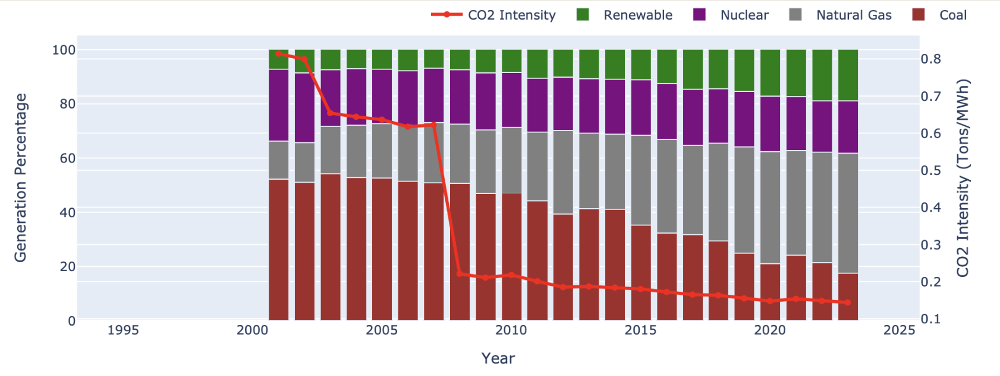

# Tracking State-Level Decarbonization

Welcome to our PPOL 5206 final project! We use open-source utility data from the [Public Utility Data Liberation Project (PUDL)](https://catalyst.coop/pudl/) to track how U.S. states are progressing in decarbonizing their electricity generation over time.

This project analyzes decarbonization trends in the United States using data from the Public Utility Data Liberation Project. It focuses on tracking electricity generation and associated carbon emissions by states over time, enabling data-driven insights into how different states are progressing toward cleaner energy portfolios.

As global energy demand continues to rise alongside increasing carbon dioxide emissions, most Americans believe that the United States should focus on advancing renewable energy sources like wind and solar. They also support efforts to move the country toward achieving carbon neutrality by 2050.

The United Nations Intergovernmental Panel on Climate Change highlights that limiting global warming to 1.5°C will necessitate reducing carbon dioxide emissions by approximately 45% from 2010 levels by 2030 and achieving net-zero emissions by 2050.

## 🔍 What You'll Find
- 💾 **[Loading PUDL Data.py](./Data%20Ingestion%20Code/Loading%20PUDL%20Data.py)** — Loads raw PUDL tables and builds a database for analysis.
- 🧮 **[decarbonization_trends.sql](./SQL%20Code/decarbonization_trends.sql)** — SQL logic to calculate state-level CO₂ and generation trends.
- 📊 **[Visualizing Decarbonization.ipynb](./Visualization%20Code/Visualizing%20Decarbonization.ipynb)** — Charts showing emissions and fuel mix.
- 🌍 **[CO₂ Animation](./animations/co2_emissions_animation_2.html)** — Animated map of changing CO₂ emissions by state.
- 📈 **Dashboard Code** — [Decarbonization Monitoring Dashboard](./Dashboard%20Code/Decarbonization%20Monitoring%20Dashboard.lvdash.json) and [Decarbonization Over Time](./Dashboard%20Code/Decarbonization%20Over%20Time.lvdash.json)
- 📁 **[Cleaned Data](./Cleaned_Data/Decarbonization_data_updated.csv)** — Updated decarbonization dataset used for analysis.
- 📊 **Charts** — [Figure 1](./Charts/figure_1.png), [Figure 2](./Charts/figure_2.png), [Figure 3](./Charts/figure_3.png), and [Figure 4](./Charts/figure_4.png)

## Why This Matters
States are making uneven progress toward decarbonization. With federal incentives and climate targets in place, this dashboard helps track which states are leading and which may need policy support.

---

## Goals of the Project
- Understand how U.S. states have shifted their electricity generation fuel mix.
- Track associated changes in CO₂ emissions over the past 10–15 years.
- Visualize decarbonization progress and identify leaders and laggards.
- Build reusable components (SQL, notebooks, dashboards) to support ongoing monitoring.

---

## Data Sources
Data is pulled from the **Public Utility Data Liberation Project (PUDL)**, which cleans and standardizes:
- U.S. Energy Information Administration (EIA) Form 923 & 860
- EPA Continuous Emissions Monitoring System (CEMS)
- Federal Energy Regulatory Commission (FERC) Form 1 (not used in this project)

---

## Requirements
- Databricks or a local Spark/SQL environment
- Python 3.x
- Pandas, SQLAlchemy, Plotly/Matplotlib for visualizations
- Access to PUDL data on AWS S3 (via [PUDL documentation](https://catalystcoop-pudl.readthedocs.io/en/latest/))

---
## Data Processing Overview

This project leverages the Public Utility Data Liberation Project (PUDL) dataset to track decarbonization trends across U.S. states. The data processing pipeline begins with ingesting large-scale energy generation and emissions data from multiple sources, including hourly emissions data, fuel receipts, and plant-level generation statistics. These datasets are cleaned, transformed, and aggregated to generate insights into state-level emissions, energy generation, and renewable capacity. The pipeline is built to scale, allowing for incremental updates and real-time dashboard integration. This approach ensures up-to-date, accurate, and comprehensive analysis of decarbonization efforts in the energy sector.

---
## CO₂ Emissions Over Time Compared to Percentage Share of Energy Source

## CO₂ Emissions Change by State Over Time 

<iframe src="./animations/co2_emissions_animation_map.html" width="100%" height="1000px" frameborder="0"></iframe>

## Policy Implications 

The PUDL project's standardized datasets, particularly hourly emissions data from EPA's CEMS, provide crucial insights for decarbonizing the US energy sector. This granular data enables effective time-of-use pricing strategies in states like California and New York, where utilities and regulators leverage real-time emissions information to shift electricity demand to cleaner periods. These datasets serve three key functions: helping states track progress toward renewable portfolio standards and emissions goals; guiding federal investment decisions under the Inflation Reduction Act and DOE programs to target areas with persistent emissions issues; and supporting public utility commissions in implementing evidence-based regulatory strategies such as performance-based rate making and grid decarbonization mandates. By making emissions patterns transparent and actionable, PUDL empowers coordinated decarbonization efforts across consumers, utilities, and governments.

---
## 📬 Contact
For inquiries, reach out via [GitHub issues](https://github.com/your-username/your-repo/issues).
